# InterfaceAgent

Computer-use automation for legacy banking software that has no API.

An LLM agent learns a task once by operating the real application. The run is compiled into a typed,
versioned **capability** artifact. From then on, the capability replays deterministically with no model in
the loop. It returns typed outputs or a classified outcome, and it hands the live session to a human
when it cannot safely continue.

The target is **CoreLink**, a deliberately legacy-style Java Swing desktop client for a fictional credit
union. It has no DOM and no test IDs, some form labels aren't wired to their fields, it uses internal frames
and modal dialogs, and faults can be injected at runtime. All data is fake.

| CoreLink member inquiry | Operator console during a handoff | Member assistant |
|---|---|---|
| 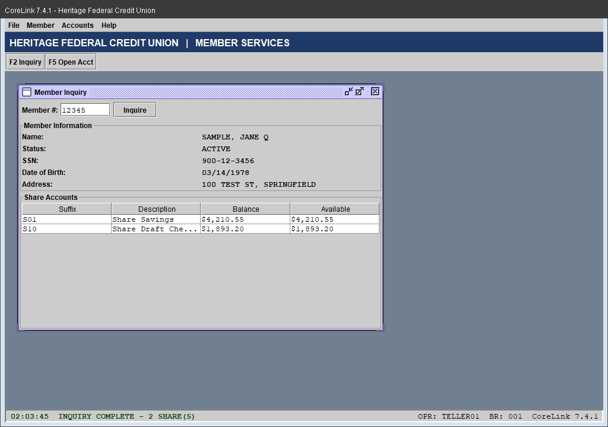 | 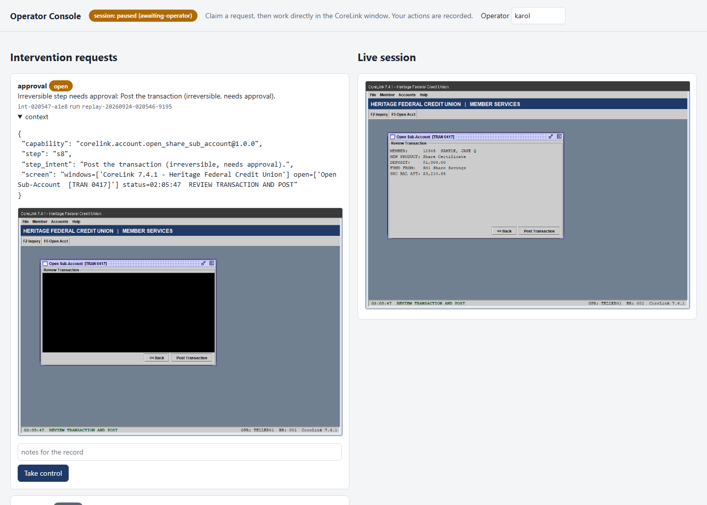 | 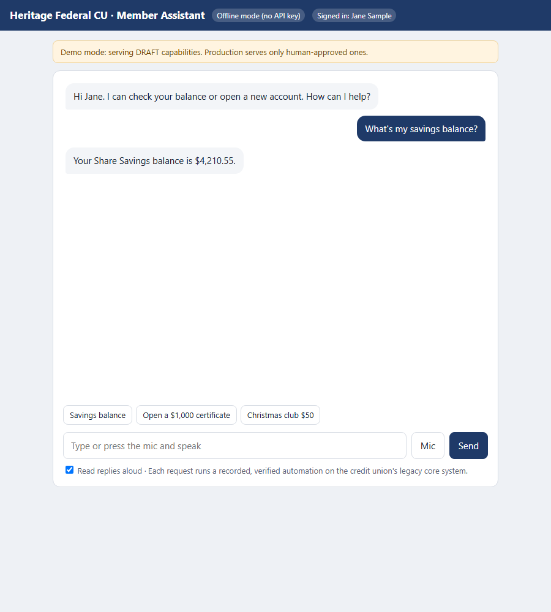 |

The design write-up is in [REPORT.md](REPORT.md), and there is also a printable
[PDF report](docs/InterfaceAgent-Report.pdf) with the architecture diagram, a requirements coverage matrix, and results.
Run evidence is in [evidence/](evidence/).

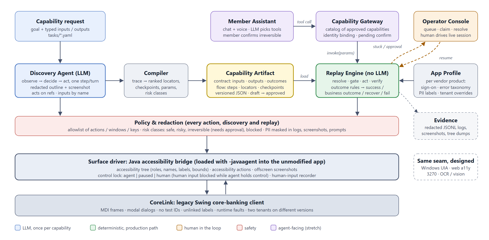

---

## How it works

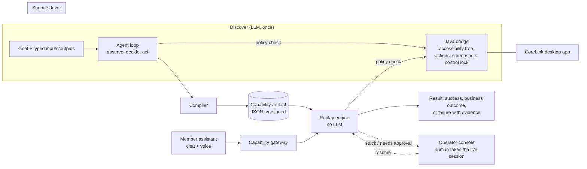

- **Surface driver.** A small Java agent (`bridge/`) attaches to the unmodified app with `-javaagent`.
  It serves the app's accessibility tree, the same data the Windows Java Access Bridge gives screen readers.
  It also serves offscreen screenshots and runs accessibility actions over localhost. It owns the
  control lock and records human input during a handoff.
- **Discovery.** The model sees a redacted accessibility outline plus a redacted screenshot. It acts by
  pointing at element references, and it refers to inputs by parameter name. It never sees raw PII,
  never types a sensitive value, and never handles credentials.
- **Capability artifact.** Each step records ranked locators, a typed value source, checkpoints, and a risk
  class. The error taxonomy is inherited from a product-level app profile.
- **Replay.** Replay resolves locators, gates each action with policy, acts, and waits on checkpoints while
  classifying anything unexpected. That can be a business outcome, a recoverable condition, a hard failure,
  or an escalation to a human.

## Quick start (Windows 10/11, PowerShell)

```powershell
git clone https://github.com/karolgit/InterfaceAgent.git
cd InterfaceAgent
.\scripts\build.ps1                       # Python 3.11 venv via uv, portable JDK 21 if needed, builds Java parts
.venv\Scripts\python.exe -m pytest -q tests
```

`build.ps1` installs nothing system-wide. It uses [uv](https://docs.astral.sh/uv/) for a project-local
Python 3.11 virtual environment. If no JDK is on PATH, it downloads a portable Temurin JDK into `.tools/`.

### Configuration

Configuration lives in a `.env` file in the repo root, which is gitignored. The repo ships
[`.env.example`](.env.example), a template with placeholder values and every key commented out. No real
key is committed. `build.ps1` copies it to `.env` if you don't have one yet. To do it by hand:

```powershell
Copy-Item .env.example .env
notepad .env        # uncomment ONE key line and paste your own key
```

Only discovery needs an LLM key. Replay, the tests, the operator console, and the member assistant's
offline mode need none.

| Setting | Purpose |
|---|---|
| `ANTHROPIC_API_KEY` | Planner `claude`, default model `claude-opus-5`, override with `CUA_MODEL`. The key comes from the Claude Console. claude.ai plan credits don't fund API keys. |
| `GEMINI_API_KEY` | Planner `gemini`, default `gemini-flash-latest`, override with `GEMINI_MODEL`. A free key is available at aistudio.google.com. |
| `CUA_PLANNER` | Forces `claude` or `gemini` when both keys are set |
| `CORELINK_OPERATOR_ID` / `_PASSWORD` | The fake demo operator the bot signs on as. Defaults are `teller01` / `demo123`. |
| `CUA_PORT` | Bridge port, default 8740. Change it to run tests while you have the app open by hand. |
| `CUA_DEMO_DELAY_MS` | Slows replays down for screen recording only |

The CoreLink credentials are fake demo values built into the mock app. Only secret names appear in
artifacts and logs. The table below lists the fake logins.

| Role | ID | Password |
|---|---|---|
| Teller | teller01 | demo123 |
| Inquiry-only clerk | viewer01 | demo123 |
| Supervisor, for the override dialog | sup01 | demo123 |

## Demo path

Every command starts its own CoreLink instance with the bridge attached and closes it afterwards.
Add `--keep-open` to leave the app window up.

**1. Discover a capability with the LLM.**

```powershell
.venv\Scripts\python.exe -m cua discover --task tasks\get_savings_balance.yaml               # planner picked from your key
.venv\Scripts\python.exe -m cua discover --task tasks\get_savings_balance.yaml --planner gemini
```

The agent signs on through the vendor profile, finds Member Inquiry, looks up the example member, and
extracts the Share Savings balance. The result is written to
`capabilities\corelink.member.get_share_savings_balance.v1.0.0.json`. The run log, per-turn redacted
screenshots, and the model's reasoning summaries go to `runs\discover-*`.

**2. Review and approve it.** Unattended replay requires `approved`. Use `--allow-draft` for supervised testing.

```powershell
.venv\Scripts\python.exe -m cua catalog          # contract view, as a calling agent sees it
.venv\Scripts\python.exe -m cua approve corelink.member.get_share_savings_balance --reviewer <your-name>
```

**3. Replay it deterministically with input parameters.**

```powershell
.venv\Scripts\python.exe -m cua replay corelink.member.get_share_savings_balance -p member_number=12345
```

```json
{ "status": "success", "outputs": { "savings_balance": "4210.55" }, "duration_ms": 1469, ... }
```

**Any share, one capability.** `corelink.member.get_share_balance` is derived from the discovered artifact by
`scripts\derive_share_balance.py`. It turns the table-row filter into a typed `share_type` input, and every
recorded step, locator, and checkpoint is reused. A share the member doesn't have returns the business
outcome `SHARE_NOT_FOUND`, not a failure.

```powershell
.venv\Scripts\python.exe -m cua replay corelink.member.get_share_balance -p member_number=12345 -p "share_type=Share Draft Checking" --allow-draft
# -> { "status": "success", "outputs": { "balance": "1893.20" } }
.venv\Scripts\python.exe -m cua replay corelink.member.get_share_balance -p member_number=12345 -p "share_type=Money Market" --allow-draft
# -> { "status": "business_outcome", "outcome": { "code": "SHARE_NOT_FOUND", ... } }
```

**4. Replay into error and exceptional states.**

```powershell
# business outcome: no such member
.venv\Scripts\python.exe -m cua replay corelink.member.get_share_savings_balance -p member_number=99999
# recoverable: session expires mid-run; re-sign-on and restart
.venv\Scripts\python.exe -m cua replay corelink.member.get_share_savings_balance -p member_number=12345 --fault session_expired=true
# hard failure: host error dialog
.venv\Scripts\python.exe -m cua replay corelink.member.get_share_savings_balance -p member_number=12345 --fault app_error=true
```

The available faults are `slow_ms=4000`, `popup=true`, `session_expired=true`, `app_error=true`, and
`permission_denied=true`.

**5. Hand the live session to a human.** Opening a large sub-account needs a supervisor override. The
automation pauses, raises an intervention request, and gives up control of the same window.

```powershell
.venv\Scripts\python.exe -m cua console      # terminal 1: operator console, http://127.0.0.1:8765
.venv\Scripts\python.exe -m cua replay corelink.account.open_share_sub_account `
    -p member_number=23456 -p "account_type=Money Market" -p initial_deposit=12000.00 -p fund_from=S10 `
    --approve-irreversible --keep-open    # terminal 2
```

In the console, click **Take control**. In the CoreLink window, enter `sup01` / `demo123` and press OK.
Then click **resume**. The replay re-checks its checkpoint and finishes. Your clicks and typing are
attached to the run's evidence. The CLI works too: `python -m cua operator list|claim|resolve`.

**6. Run the whole scenario matrix.** It regenerates `evidence\replays` and needs no API key.

```powershell
.venv\Scripts\python.exe scripts\scenarios.py --out evidence\replays
.\scripts\demo.ps1                 # or: real discovery for both tasks, then the matrix
```

**7. Try the member assistant.** It works as chat, or as voice in Chrome or Edge.

```powershell
.venv\Scripts\python.exe -m portal.app --allow-draft     # http://127.0.0.1:8800
```

Sign in as a demo member. Ask "What's my savings balance?" or "Open a share certificate with $1,000 from
my savings." With an API key set, the LLM assistant chooses capabilities as tools. Without a key, a small
offline intent router drives the same gateway. The member number comes from the signed-in session and is
never a tool parameter. Irreversible actions wait for the member to press **Confirm**.

## Running without live services

| What | Needs an API key |
|---|---|
| Unit tests (`pytest -q tests`) | No |
| Replay of saved capabilities, all scenarios, and the operator console | No |
| Member assistant in offline mode | No |
| Harness check with the scripted planner: `cua discover --planner scripted --script tests\scripts\get_savings_balance.json` | No. It is a test double and is labeled `discovered_by: scripted-test` |
| Real discovery and the member assistant's AI mode | Yes |

## Screens

| | |
|---|---|
| 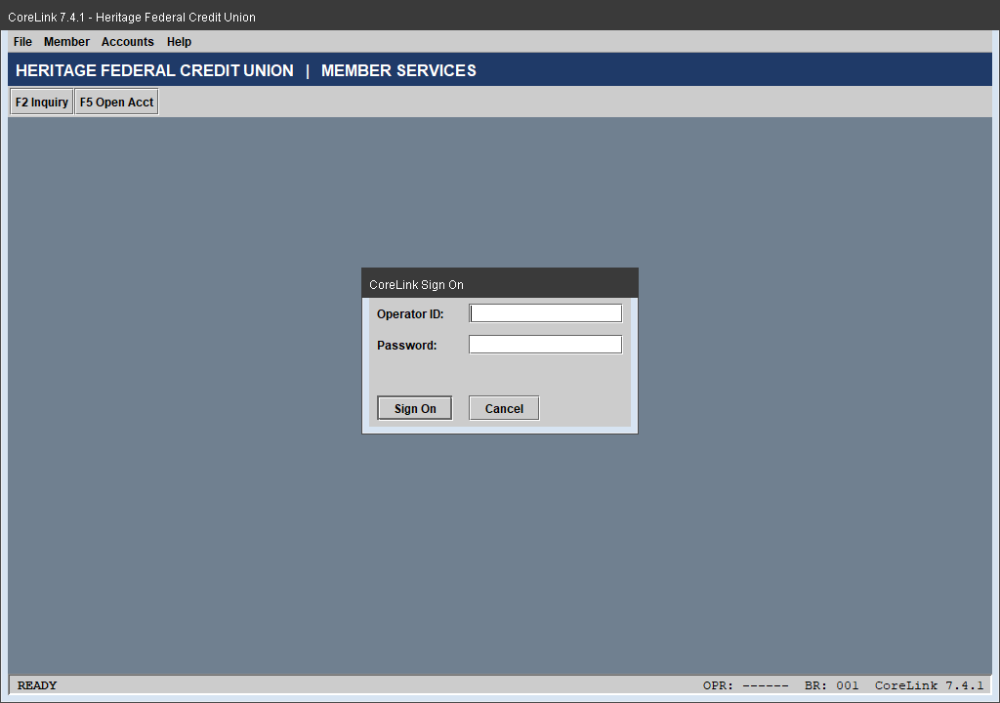 **Sign-on.** Credentials come from the secret store by name. | 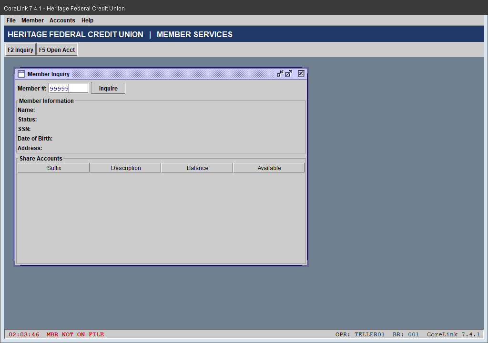 **Business outcome.** `MBR NOT ON FILE` becomes `MEMBER_NOT_FOUND`. |
| 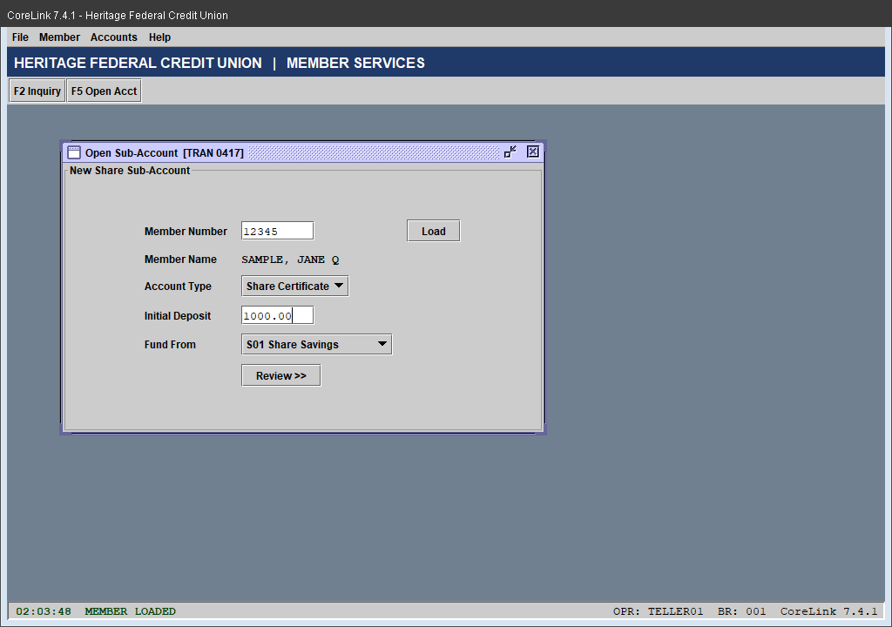 **Unlinked labels.** Fields are found by label geometry. |  **Review screen,** the step before the irreversible post. |
| 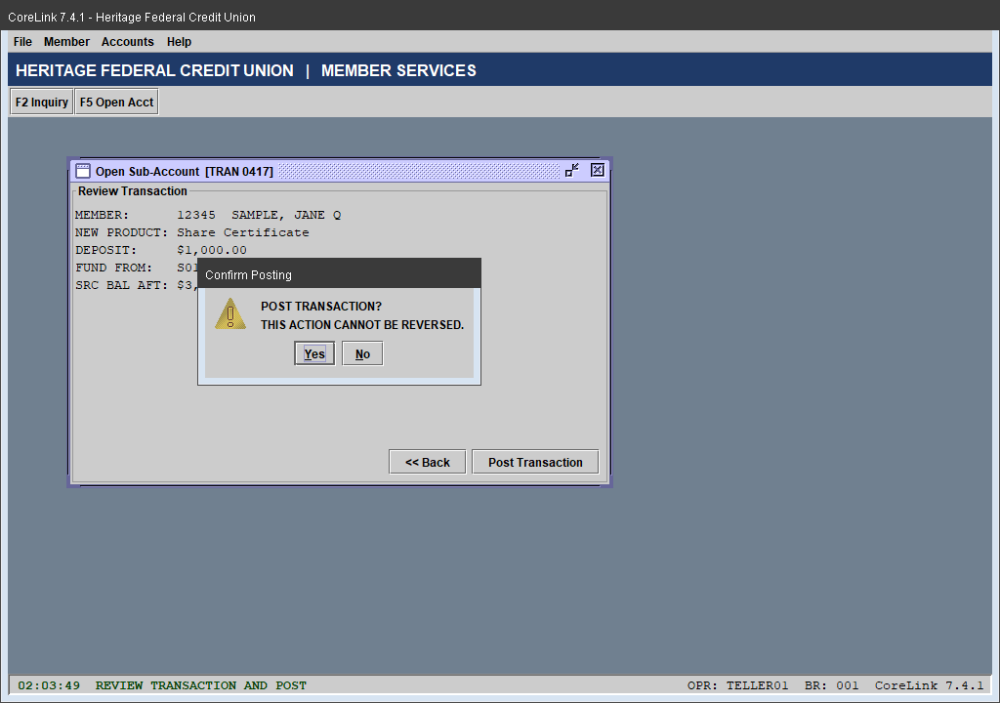 **Irreversible.** Policy requires an approval grant or a human. | 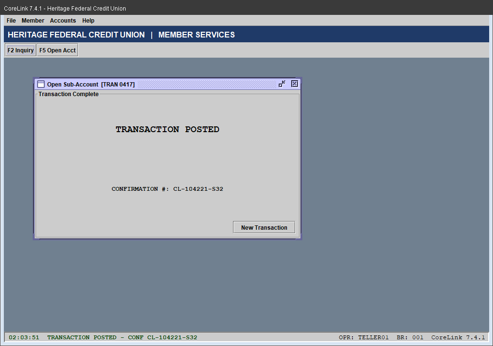 **Output.** The confirmation number is extracted with a capture pattern. |
| 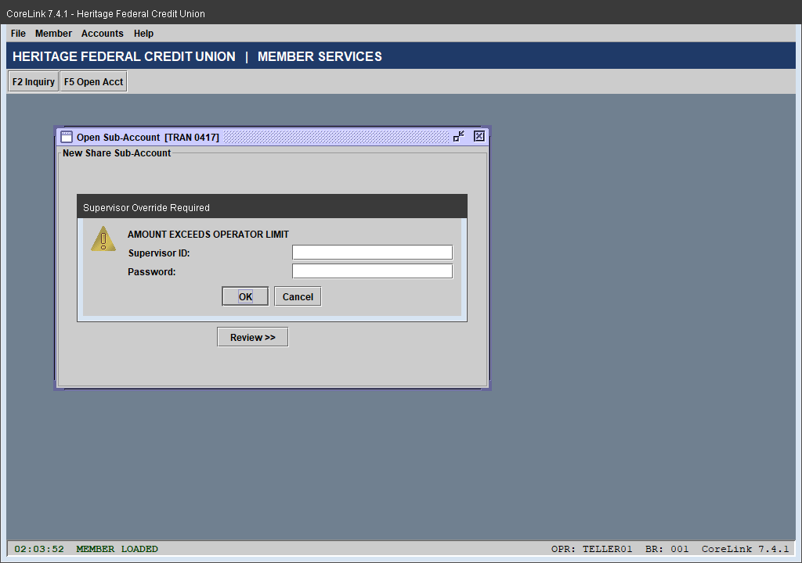 **Escalation.** The supervisor override goes to a human. | 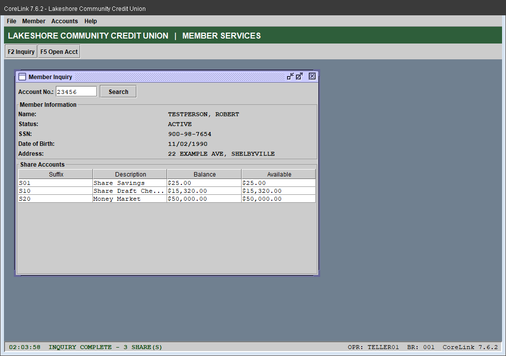 **Second tenant.** The same capability replays through label and name overrides. |
| 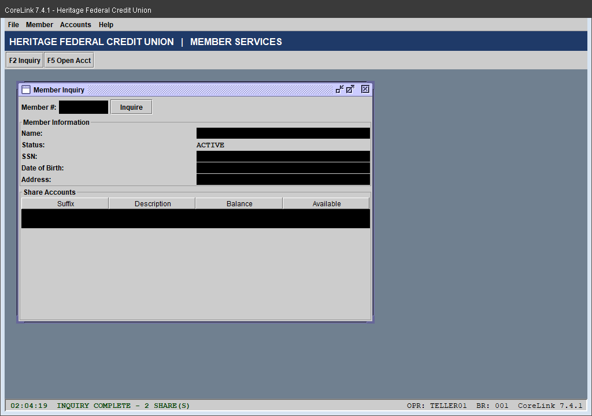 **Evidence** is redacted from accessibility bounds. | 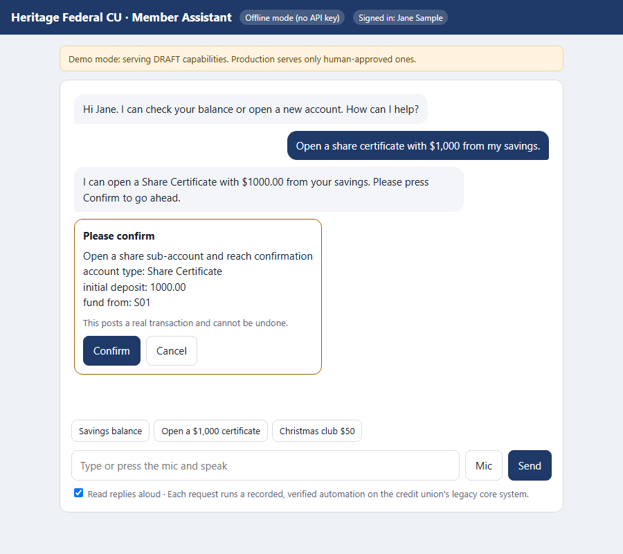 **The member confirms** an irreversible action. |

## Repository layout

| Path | What |
|---|---|
| `mockcore/` | The CoreLink Swing app, the proxy target. It has fault injection and two tenants. |
| `bridge/` | The Java agent: accessibility tree, actions, screenshots, control lock, and input recorder. |
| `cua/surface/` | The surface abstraction and the Swing driver. |
| `cua/agent/` | The discovery loop, the model tool surface, and the trace-to-artifact compiler. |
| `cua/artifact.py` | The capability and run-result schema, version `cua.capability/v1`. |
| `cua/replay.py` | The deterministic replay engine and outcome classification. |
| `cua/locate.py` | Locator building at record time and resolution at replay time. |
| `cua/policy.py`, `configs/policies/` | The allowlist and risk classes. |
| `cua/redact.py` | Text, observation, and screenshot redaction. |
| `cua/handoff.py`, `cua/console.py` | The control-transfer model, intervention queue, and operator console. |
| `cua/gateway.py`, `portal/` | The capability catalog and invoke gateway, and the member assistant. |
| `configs/apps/corelink.yaml` | The vendor-product profile: sign-on, shared outcome rules, PII labels, and tenant overrides. |
| `tasks/` | Capability requests given to discovery. |
| `capabilities/` | Saved capability artifacts. |
| `schemas/` | JSON Schema for the artifact and the run result. |
| `scripts/` | Build, demo, scenario matrix, screenshot capture, and the simulated operator. |
| `evidence/` | Discovery and replay evidence. |

## License and data

This is a take-home project. All member data, SSNs, operators, and institutions are fictional. SSNs use
the never-issued 900 series.
